# Luhmann - Knowledge Sharing Platform

Luhmann is a knowledge sharing platform that allows users to develop and store their documents in a nested tree fashion. Documents can be connected to create a rich environment for knowledge management. Luhmann also offers collaborative features to enhance the sharing and creation of knowledge.

## How it works

Luhmann relies on leafs. Leafs are the unit of knowledge, containing a task, a title, a text or an image. These leafs can be branches, and contain other leafs. This way we have like a tree of nodes.

## Features

### Home

#### Grouping leafs

Simple way to group your leafs in different groups for less cluttered view.

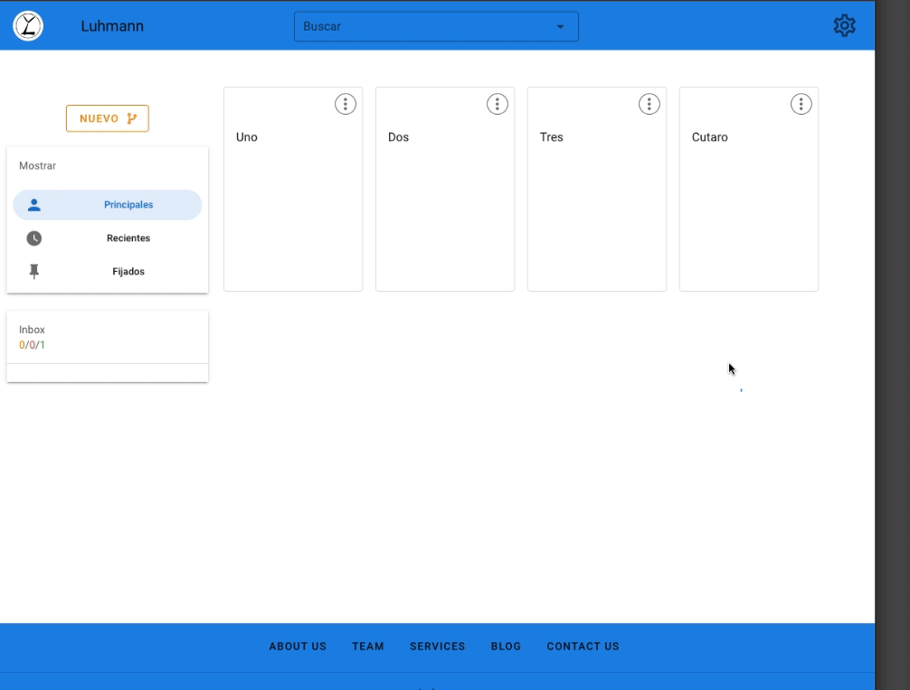

#### Filtering leafs

In the homepage you can filter the branches by recent (recently opened branches), main (those branches that dont have parents, they are the ancestors of many leafs) and pinned.
Here is how you pin a leaf/branch.

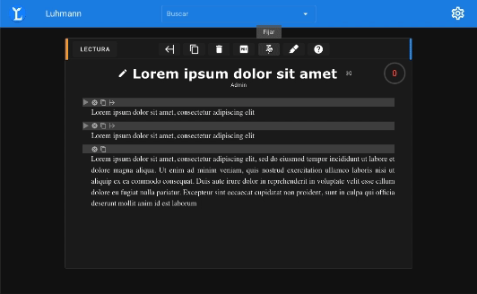

## Branch Display

### Images

You can display images in the leafs too. Of course, they are resizable.

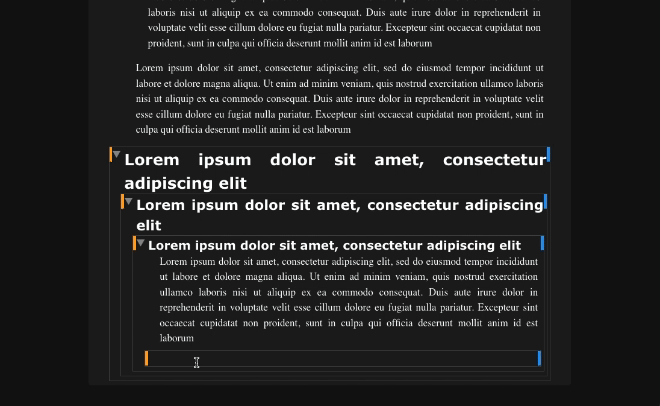

### Inline Style

Using this inline toolbar you can select some text and select different styles. You can also search the selected text in the web!

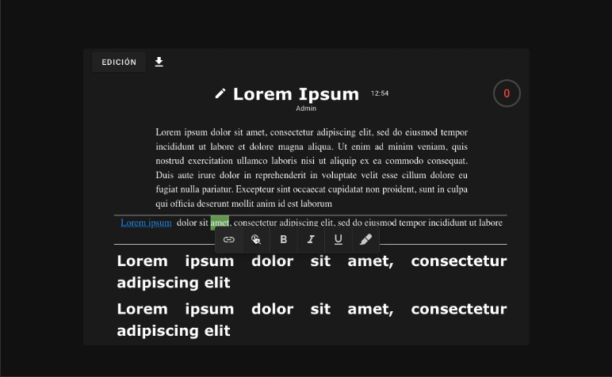

### View mode

You can toggle between reading and writing mode. The writing mode provides the full UI to let you work with all our tools. In the reading mode you have a simple, zen UI that lets you focus on the text itself.

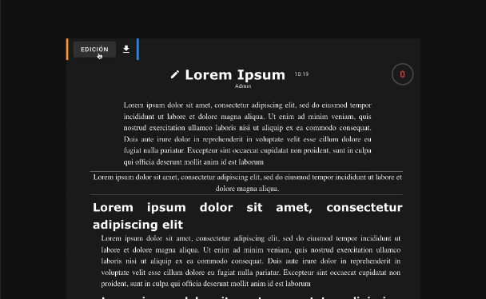

### Styling

Its possible to decide which style each life has. You can have them as headers, keywords section, or abstract section. You decide!

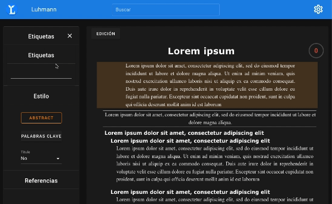

## Branch Exams

Luhmann offers you a feature where you can examine and test your skills. Next to each title of each branch you will have displayed your current score. If you havent taken any examns, it will 0.

### Deeplight

Exam creation relies on the deeplight. You set the "deeplight mode" and start selecting text. Then you can add different options that will replace your selected text.

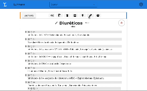

### Exams

The exams are created based on your deeplights, and have 5 options. Only 1 is true, choose wisely! How long will you be able to hold a streak?

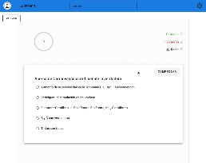

Bad scores will result in the display of neggative, red points on the leafs. If your score is good, you will have positive green points.

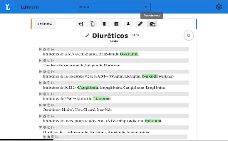

## Branch Collaboration

We have worked ways to let you work in group too. Here are the 2 main features that help you do that!

### Dynamic update

Using websockets, frontend will be requesting data to the server every x seconds. It is not full websockets, because I was unexperienced. But, it sets django asgi and a consumer that responds with different data to the regular data update requests with the proper data. Here is how it looks.

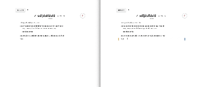

You can also reorder the leafs as you please, and the changes will be displayed too!

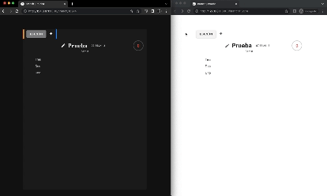

### Annotation

Simple issues system. Just click on the right side, add an annotation, set a date and thats all. You can click the button for the issue to toggle between the states. Do/Doing/Done issues will appear in the home too!

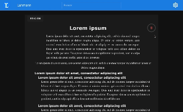

## Branch Connection

### Expantion

You can click the expand button and navigate to that leaf, setting that leaf to be the current viewing branch.

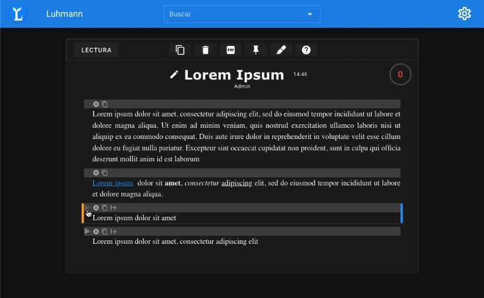

### Embeds

You can embed leafs into another leafs/braches. Just click and insert them! They will appeared on the references section, just below the styling.

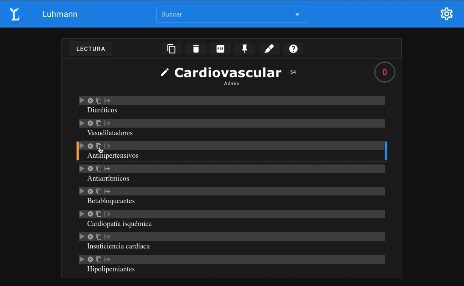

### Links

You can create links between leafs. Similar to embeds, but the way the connection is created is different. Of course, they also appear on the references section.

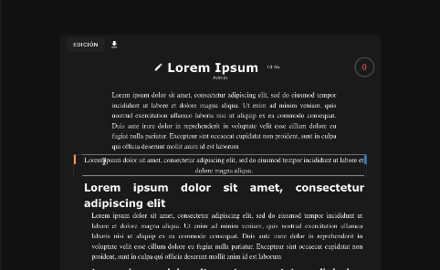

## Settings

Although simple, not less relevant! You can decide the base font size of your documents, your desired font and, you can toggle between dark and light mode!

## Technologies used

## Challenges overcomed

This was my second full stack project, and I learned a lot. I got started into Vue, learned about good coding practices, and learned to deploy an application (on heroku). Heroku is no longer free so I will have to find another service to deploy.

### Data queries

I dearly remember this challenge. I didn't know how to query all the leafs for a branch in a efficient manner. For large documents, doing a recursive approach was too slow. I was making too many database queries. You can see how much time it took to retrieve the data. Blocks was the time searching for the leafs took. It was taking 49 second, for a total of 50.7 seconds in this test.

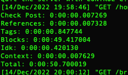

So, I decide to add another field, ancestors. This way I could request all the childs with a simple filter query! We can see it made it so much faster. Now blocks just took 0.000173 seconds. Total seconds was now just 1.76 seconds. Quite an improvement right?

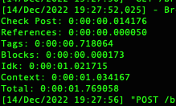

## Conclusion

Luhmann is more than a project; it's a canvas where I've honed my skills and put my learning into practice. This endeavor, my inaugural full-stack project, represents countless hours of dedication and growth.

As a knowledge-sharing platform, it showcases my abilities in frontend and backend development, including Vue.js and Django. Luhmann demonstrates my proficiency in database management, real-time features, and efficient data querying.

While it's been a journey of learning and discovery, this project is primarily a testament to my skill set. It stands as an example of my capabilities in web development and knowledge management.

As you explore Luhmann, I invite you to see it as a reflection of my expertise and a valuable addition to my portfolio. It's a platform where I put theory into practice, and I'm excited to continue refining it.

